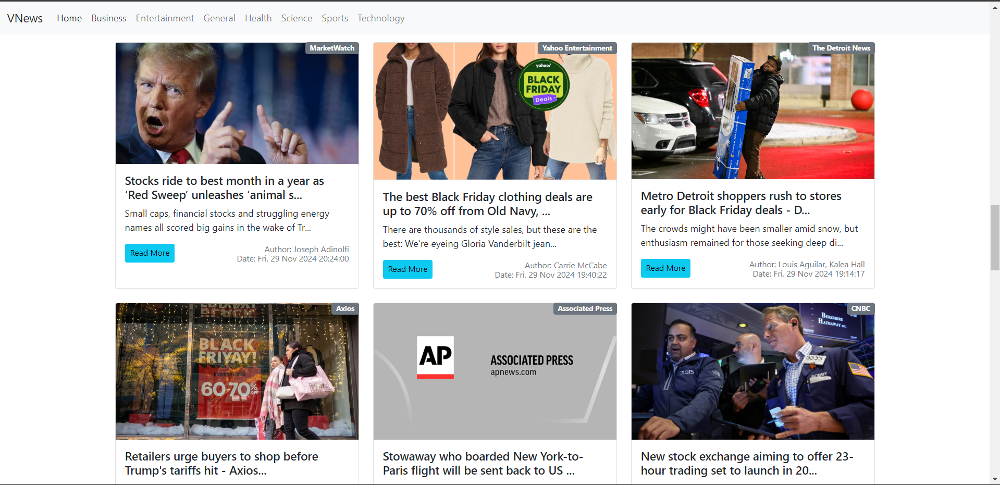
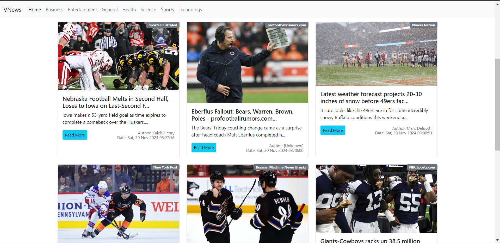
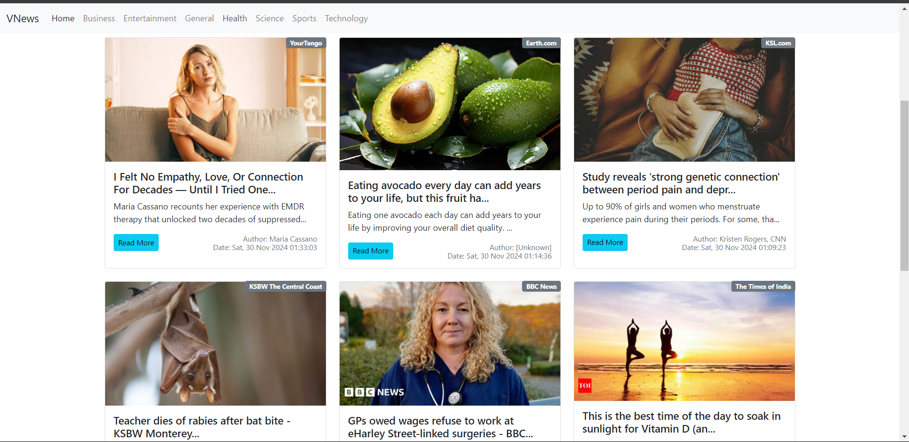

# VNews - Real-Time News Application

**VNews** is a **React.js** application that provides users with real-time news updates across various categories. The app fetches news from an external API and uses **React Router** for seamless navigation. Users can explore news articles by category and click the **Read More** button to visit the source website for detailed information.

---

## Features

### **News Categories**
Stay updated with the latest news in these categories:
- **Business**
- **Entertainment**
- **General**
- **Health**
- **Science**
- **Sports**
- **Technology**

### **Real-Time Updates**
- Fetch and display the latest news using a reliable **news API**.
- News is displayed with a headline, description, and publication date.

### **Read More Option**
- A **Read More** button for each news item allows users to visit the original news source for full details.

### **React Router Integration**
- Navigate effortlessly between categories using **React Router**.
- Each category has its dedicated page for focused browsing.

### **Responsive Design**
- Fully responsive interface for a seamless experience on desktops, tablets, and mobile devices.

---

## How to Run the Project

1. **Download the Project**
   - Clone or download the built project files to your local machine.

2. **Host the Project**
   - Open the project folder in **VS Code**.
   - Use the **Live Server Extension** to host the project:
     - Install the **Live Server Extension** in VS Code (if not already installed).
     - Right-click the `index.html` file in the project folder and select **Open with Live Server**.

3. **Access the Application**
   - The app will open in your default web browser, allowing you to explore real-time news.

---

## Usage Instructions

1. **Select a Category**: Use the navigation menu to choose a news category.
2. **Browse News**: Scroll through the list of headlines and summaries for the selected category.
3. **Read Full Article**: Click the **Read More** button to visit the source website for the full news article.

---

## Technologies Used

- **React.js**: For building the user interface.
- **React Router**: For client-side navigation.
- **CSS**: For responsive and visually appealing design.
- **News API**: For fetching real-time news data.

---

## Screenshots

### Business News

### Sports News

### Health News

---

## Future Enhancements

- **Search Functionality**: Allow users to search for news articles.
- **Saved Articles**: Add the ability to bookmark articles for later reading.
- **Theming Options**: Provide Light and Dark mode options.

---

## Contributing

Contributions are welcome! Feel free to fork the repository, make changes, and submit a pull request.

---

## License

This project is licensed under the **MIT License**.
